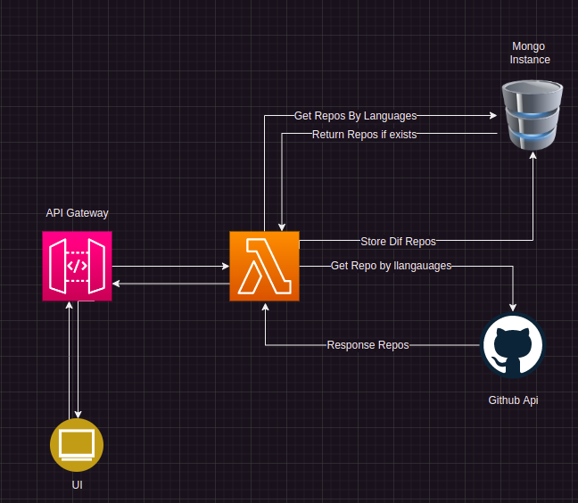
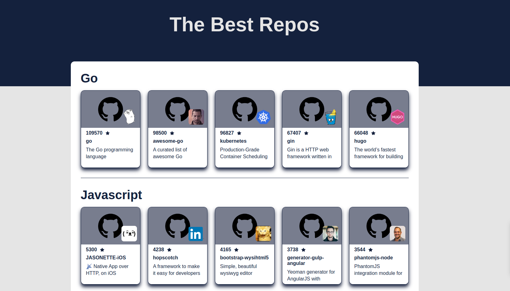

# Desafio desenvolvedor fullstack - GB

* Autor: José Veríssimo dos Santos Sacramento neto
* Desafio: “Listar os repositórios destaque do GitHub de cinco linguagens”.

Teste para avaliar tecnicamente candidato para a vaga de desenvolvedor node serverless.

## Como rodar localmente

### Variáveis de ambiente:
  - Crie um arquivo `.env` na raiz do projeto com as seguintes chaves:
    - GITHUB_BEARER_TOKEN - Token gerado na conta do github [Como gerar seu token](https://docs.github.com/en/rest/overview/authenticating-to-the-rest-api?apiVersion=2022-11-28)
    - GITHUB_BASE_URL - https://api.github.com
    - DATABASE_URL - Url de conexão com mongoDb

### Banco de dados
 - Tenha instalado docker e docker compose
 - Na pasta `/backend` rode o comando ```docker-compose up -d```
 - Será instalado um instância do mongoDb

### Backend Serverless

 - Tenha instalado o nodeJS na versão `18x`
 - Na pasta `/backend` rode o comando ```npm install```
 - Após iniciar banco de dados, rode o comando ```npm run dev```

### Frontend NextJs

 - Tenha instalado o nodeJS na versão `18x`
 - Na pasta `/frontend` rode o comando ```npm install```
 - Após iniciar o Backend, rode o comando ```npm run dev```

### Testes Automatizados
  - Para executar os testes, abra a pasta `/backend` ou `/frontend` e rode o comando ```npm test```
  > Dessa forma serão executados todos os testes da aplicação. Para o backend, é necessário estar com banco de dados configurado.
---

### Requisitos:
- [x] NodeJS;
- [x] Serverless;
- [x] Banco de dados;
- [x] Swagger;
- [x] Testes de unidade;

### Funcionalidades:
- [x] Buscar e armazenar os repositórios destaque (stargazers count) de 5 linguagens a sua escolha;
- [x] Listar os repositórios encontrados;
- [x] Visualizar os detalhes de cada repositório;
- [x] Armazenar as informações encontradas em banco de dados;

### Desafio:
- [x] O deploy em um ambiente público;
- [x] Front-end para listar os repositórios encontrados;

---
## Conceitos utilizados:
Foram utilizados nesse projeto os conceitos:
  - `Desenvolvimento orientado a testes`, que facilita o entendimento das funcionalidade que estão sendo desenvolvidas, tendo assim etapas de criação e validação formando um ciclo que garnado uma melhor qualidade de entrega de código.
  - `Arquitetura Hexagonal`, um padrão de design de software que visa desacoplamento daquilo é conectado a aplicação, facilitando uma possível substituição desses conectores.
  - `Domain-Driven Design` e `Clean Architecture`, um conjunto de princípios e patterns que ajudam a criar um software em camadas com o domínio bem protegido dos outros componentes da aplicação, visando garantir a invariância das entidades de negócio.
  - `SOLID`, alguns princípios para facilitar a manutenção, criação e entendimento do software.
  - `CQRS`, padrão de separação de operações de leitura e escrita visando a melhor performance no trafego de dados entre o banco e as aplicações.
--- 

## Fluxo lógico que utilizei para implementação do backend:
 - Quando a Lambda é executada, é feita uma busca no banco de dados a partir do nome das linguagens previamente escolhidos. Com o retorno do banco de dados, é feito um diff do que foi encontrado no banco e o que foi solicitado, em seguida a aplicação busca as informações das linguagens que não foram encontradas à API do github, em seguida guarda no banco os novos dados buscados e retorna a mescla dos dados como resposta da requisição.
    
     
  > Fluxo da aplicação 
---

## Front-End
  - Aplicação NextJs com Typescript;

    

